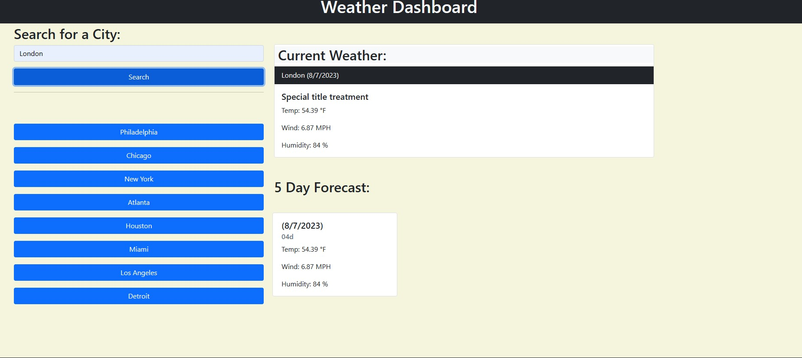

# WeatherDashboard

## Task

This challenge was to allow deveoplers to use a third-party API to retrieve data with specific parameters to a URL. Developers many times utilize API's from applications and work with them for their own use. In this challenge a Weather Dashboard was built that consisted of updated dynamic HTML and CSS. Powered by script.

The openweathermap.org site was used to compile data and access an authentic API key/API id.

With these tools developers can now find the weather in any city based upon geographical coordinates.


## User Story

```
AS a person with a busy schedule
I WANT to be up to date with the forecast for cities SO THAT traveling will be not only possible but well prepared for
```

## Acceptance Criteria

```
GIVEN a dashboard with access to current weather
WHEN a city is searched
THEN I receive results of multiple aspects of weather conditions for the city that was submitted into the search input
WHEN I take a look at the weather presented for that city I can see the city name, the current date, the temperature, the humdity percentage, and the wind speed in MPH
WHEN I view future weather conditions for that city 
THEN I am presented with the weather projection for the next 5 days
WHEN I click on the cities searched
THEN I will see the current and future conditions for that city
```

### Screenshot

https://drive.google.com/file/d/1bSgtvLKYFvymD8KnwLwQEhQQC5yoKz5q/view?usp=drive_link


